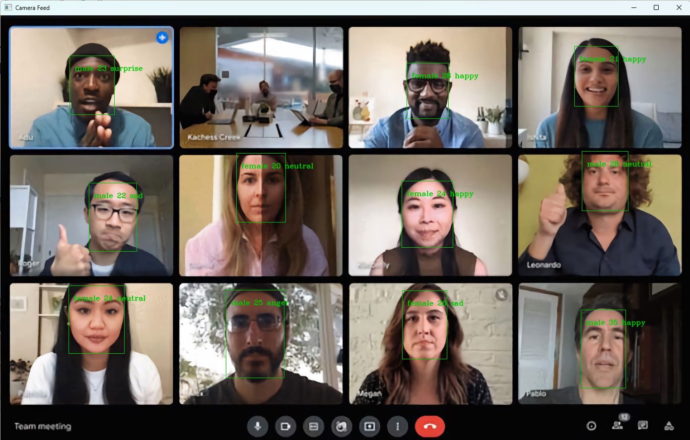
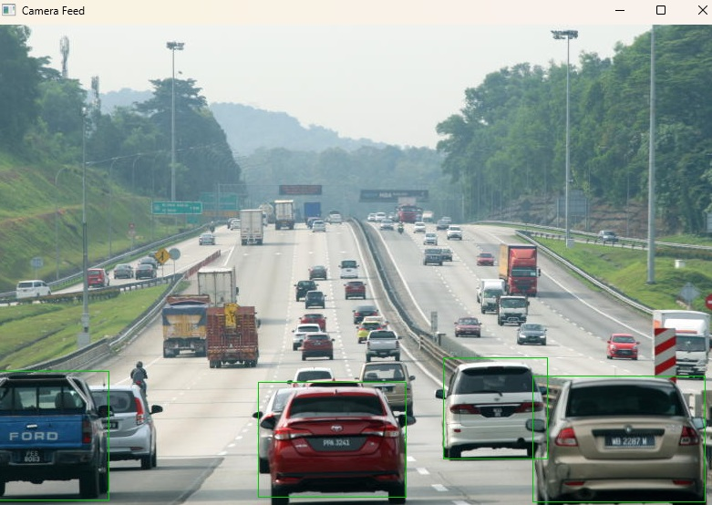
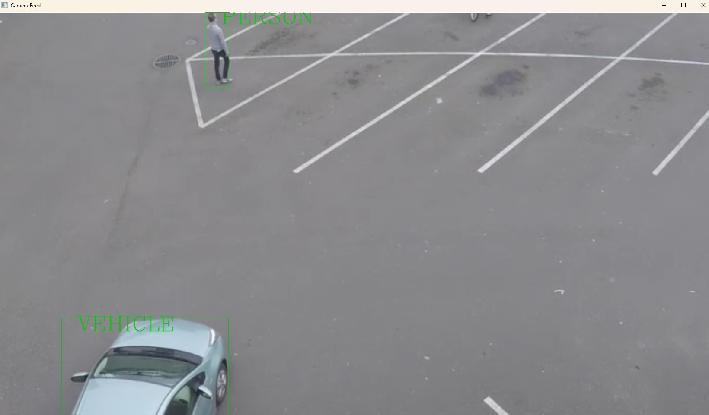

# Intel OpenVino Demo
A straightforward OpenVino demonstration suitable for newcomers. 

## Clone Repo
```
git clone https://github.com/yockgen/openvino-demo.git
```
```
cd openvino-demo
```
## Setup Virtual Environment
OpenVino required many dependecies software and may conflict with user's existing Python libs and usually costed time to debug, created virtual is the safer way to avoid such conflict
```
python -m venv openvino
```
```
 .\openvino\Scripts\activate
```
If succeed, user shall see prompt with venv prefix, example as below:
```
 (openvino) PS C:\openvino-demo>
```
## Install pre-requisties
```
pip install -r requirements.txt
```
## CPU or GPU
The script by default is expected to run on Intel Integrated GPU, if user would like to change to CPU, please modify accordingly "device_name" in "face.py" (3 of them): 
```
 self.compiled_model = ie.compile_model(model=model, device_name="GPU")
```
___
## Run Test 1: Face, Age, Gender and Emotion Detection
```
python face.py
```
If succeed, the script will access first webcam of your device, and start detect faces, emotions, gender and age.

___
## Run Test 2: Cars Detection
```
python vehicle.py
```
If succeed, the script will access first webcam of your device, and start detect vehicles.

___
## Run Test 3: Cars, Person and Bike Detection
```
python personVehicleBike.py
```
If succeed, the script will access first webcam of your device, and start detect vehicles.

___
## Run Test 4: Integration with HuggingFace on text Classification on positive or negative tone
```
python personVehicleBike.py
```
If succeed, the script will prompt for user text input and classified the text's emotion
```
Please enter text to classify (or 'q' to quit): I like Penang very much
[{'label': 'POSITIVE', 'score': 0.9997014403343201}]
Please enter text to classify (or 'q' to quit): THe product not so as expected
[{'label': 'NEGATIVE', 'score': 0.9751037359237671}]
Please enter text to classify (or 'q' to quit):
```


___
## To play with more other inferencing models
1. list all downloadable models from OpenVino
```
omz_downloader --print_all
```
2. Download the model
```
 omz_downloader --name text-recognition-0012 --precision FP16
```
Upon succeed, user shall see xxx.xml and xxxx.bin model files been download to local directory

3. Use the "face.py" code as reference code to use the new model. 
